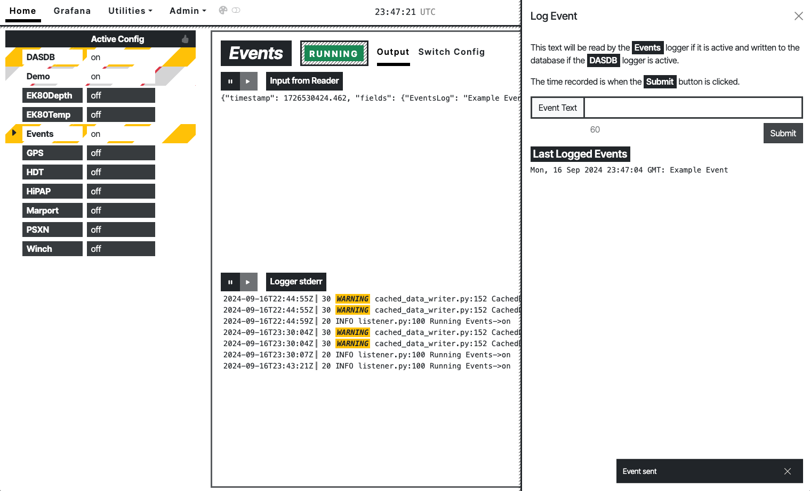
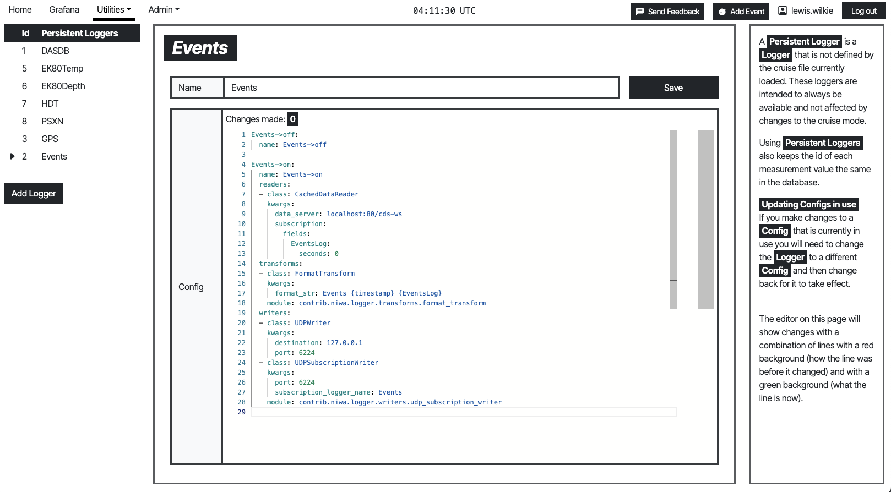
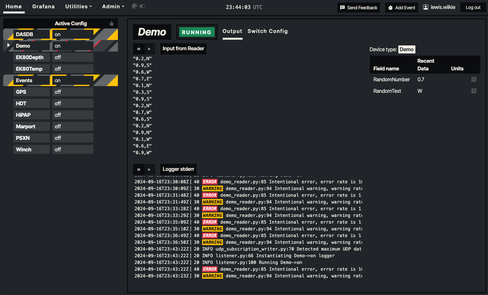

# DAS UI

This is a frontend React app built by NIWA for use with OpenRVDAS.








## Developing Locally

This app runs on vite. You can run it locally if you have node.js installed by running `npm install` in the root directory then `npm run dev`. You will need to create a `.env` file using `.env.dist` as a guide to set the location of the openrvdas backend.

## Building and Deploying in Production

Run `npm run build` to create the `dist` folder then run `install_das-ui.sh` to build the docker image.


### Tips

#### Running without a cruise file

If you plan to use only persistent loggers (ones defined on the loggers screen not via a cruise file) you will still need to load a "blank" cruise file for openrvdas to operate. Example blank cruise:


```yaml
cruise:
  id: Blank
  start: '2024-01-01'
  end: '3024-12-31'

loggers:
  blank:
    configs:
    - blank->off
    - blank->on

modes:
  'off':
    blank: blank->off
  'on':
    blank: blank->on

default_mode: 'off'

configs:
  blank->off:
    name: blank->off

  blank->on:
    name: blank->on
```

You can remove the "blank" logger after loading this cruise file using the django admin site.