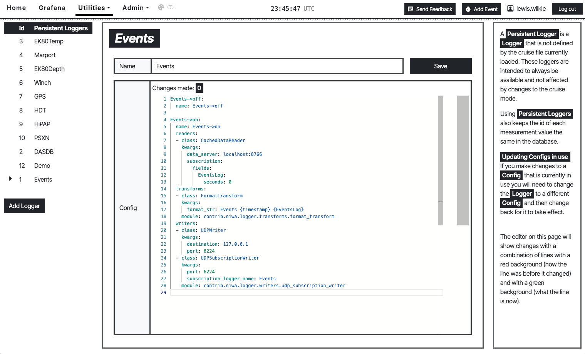

# DAS UI

This is a frontend React app built by NIWA for use with OpenRVDAS.

## Developing Locally

This app runs on vite. You can run it locally if you have node.js installed but running `npm install` in the root directory then `npm run dev`

## Building and Deploying in Production

tbc.